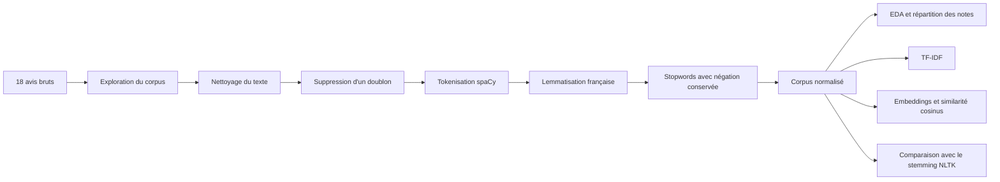

# NLP Fil rouge — Analyse d’avis en français

> Un parcours pratique de traitement automatique du langage pour transformer des avis bruyants en données exploitables.

Ce dépôt contient le travail réalisé dans le cadre du module **Natural Language Processing — Efrei M1**. Le projet suit un petit corpus d’avis utilisateurs, depuis les données brutes jusqu’aux premières représentations numériques du texte.

L’objectif n’est pas seulement de faire tourner une suite de fonctions : c’est de comprendre ce que chaque transformation apporte, ce qu’elle risque de faire perdre, et comment choisir une représentation adaptée à une analyse NLP en français.

## Le fil rouge en un coup d’œil



## Ce que le projet montre

- **Préparer un corpus réel** : casse irrégulière, espaces superflus, ponctuation expressive, balises HTML et URL.
- **Préserver le sens** : la négation (`ne`, `pas`, `non`, `sans`) est volontairement conservée.
- **Comparer deux normalisations** : la lemmatisation avec spaCy reste lisible, tandis que le stemming Snowball produit ici des formes plus difficiles à interpréter.
- **Passer du texte aux nombres** : le Jour 2 introduit l’analyse exploratoire, la vectorisation TF-IDF et les embeddings de phrases.
- **Relier texte et supervision** : chaque avis possède une note de 1 à 5, utilisable pour observer la répartition des classes.

## Résultats clés du Jour 1

Le corpus source contient **18 commentaires** et **17 textes uniques** après suppression du doublon. Il inclut volontairement plusieurs formes de bruit :

- balises HTML (`<p>`, `<br>`),
- URL et espaces atypiques,
- répétitions de ponctuation,
- majuscules, accents et émojis,
- avis positifs, négatifs et mitigés.

Le pipeline documenté dans le notebook rapporte ensuite :

| Étape | Observation |
| --- | ---: |
| Commentaires initiaux | 18 |
| Doublons supprimés | 1 |
| Commentaires conservés | 17 |
| Tokens avant suppression des mots vides | 113 |
| Tokens après suppression des mots vides | 74 |
| Taille du vocabulaire final | 66 |

Ces nombres dépendent naturellement de la version du corpus et des règles de prétraitement exécutées.

## Organisation du dépôt

```text
.
├── corpus_avis.csv          # Corpus d’avis et notes
├── TP_Jour1.ipynb           # Préparation, nettoyage et normalisation NLP
├── TP_Jour2.ipynb           # EDA, TF-IDF et embeddings (en cours de construction)
├── main.py                  # Point d’entrée minimal du projet
├── pyproject.toml           # Métadonnées et dépendances du projet
├── requirements.txt         # Environnement Python figé
└── Docs/
	├── TP_1/
	│   ├── Jour1_TP_Guide.pdf
	│   └── Jour1_Cours_Slides-v2.pdf
	└── TP_2/
		└── Jour2_TP_Guide.pdf
```

## Installation

Le projet demande **Python 3.12 ou une version ultérieure**.

### Avec `venv` et `pip`

```bash
python -m venv .venv
```

Sous Windows PowerShell :

```powershell
.\.venv\Scripts\Activate.ps1
python -m pip install --upgrade pip
pip install -r requirements.txt
```

Sous macOS ou Linux :

```bash
source .venv/bin/activate
python -m pip install --upgrade pip
pip install -r requirements.txt
```

Le modèle français spaCy est déjà référencé dans `requirements.txt` : `fr_core_news_sm`.

### Avec un environnement géré par le projet

Le `pyproject.toml` déclare les dépendances principales : Jupyter, pandas, spaCy, NLTK, scikit-learn, matplotlib et sentence-transformers.

```bash
pip install -e .
```

Pour le notebook contenant le stemming, NLTK peut télécharger ses stopwords au premier lancement :

```python
import nltk
nltk.download("stopwords")
```

## Utilisation

1. Ouvrir le dossier dans VS Code ou lancer Jupyter Lab :

   ```bash
   jupyter lab
   ```

2. Exécuter [TP_Jour1.ipynb](TP_Jour1.ipynb) dans l’ordre, de haut en bas.
3. Vérifier ou régénérer [corpus_avis.csv](corpus_avis.csv) pendant l’étape de chargement des données.
4. Explorer [TP_Jour2.ipynb](TP_Jour2.ipynb) pour poursuivre avec l’analyse exploratoire, TF-IDF et les embeddings.

Le script [main.py](main.py) est actuellement un point d’entrée de démonstration qui affiche un message. Le cœur fonctionnel du TP se trouve dans les notebooks.

## Détail du pipeline NLP

### 1. Nettoyage

La fonction `clean_text` :

- convertit le texte en minuscules ;
- retire les balises HTML ;
- retire les URL ;
- réduit les répétitions de ponctuation ;
- normalise les espaces ;
- supprime la ponctuation résiduelle et les émojis.

Les accents sont conservés, car ils participent à l’information linguistique du français.

### 2. Tokenisation et lemmatisation

spaCy et le modèle `fr_core_news_sm` transforment chaque avis en tokens, puis ramènent les mots à leur lemme. Par exemple, cette étape cherche à rapprocher différentes formes grammaticales d’un même mot tout en conservant une sortie lisible.

### 3. Stopwords et négation

Les mots vides sont retirés pour limiter le bruit, mais la négation est explicitement protégée. C’est un choix important pour l’analyse d’avis : supprimer `pas` pourrait transformer un avis négatif en signal trompeusement positif.

### 4. Stemming : une comparaison instructive

Le bonus utilise `SnowballStemmer("french")`. Dans ce corpus, les formes tronquées deviennent parfois moins naturelles et moins compréhensibles. Cette expérience illustre qu’une méthode plus agressive n’est pas automatiquement meilleure : la lisibilité et la tâche finale comptent.

## Jour 2 : de la linguistique aux représentations numériques

Le second notebook ouvre trois pistes :

1. repérer les mots dominants et observer la répartition des notes ;
2. vectoriser les avis avec **TF-IDF** grâce à scikit-learn ;
3. construire des **embeddings de phrases** et comparer les avis avec la similarité cosinus.

Le notebook est actuellement amorcé avec ses objectifs et ses imports. Les résultats complets de cette partie restent donc à construire ou à compléter.

## Limites et pistes d’amélioration

Ce corpus est volontairement petit et pédagogique. Les résultats ne doivent pas être généralisés à une population réelle. Pour aller plus loin :

- augmenter le nombre d’avis et équilibrer les notes ;
- séparer les données d’entraînement et de test ;
- comparer plusieurs modèles d’embeddings français ;
- mesurer la qualité avec des métriques adaptées ;
- ajouter des visualisations reproductibles ;
- extraire les fonctions du notebook dans un module Python testable ;
- transformer `main.py` en véritable point d’entrée avec des arguments de ligne de commande.

## Ressources du TP

- [Guide du Jour 1](Docs/TP_1/Jour1_TP_Guide.pdf)
- [Slides du cours du Jour 1](Docs/TP_1/Jour1_Cours_Slides-v2.pdf)
- [Guide du Jour 2](Docs/TP_2/Jour2_TP_Guide.pdf)

## Technologies

`Python` · `Jupyter` · `pandas` · `spaCy` · `NLTK` · `scikit-learn` · `sentence-transformers` · `matplotlib`

---

Projet pédagogique réalisé dans le cadre du Master 1 à l’Efrei.
